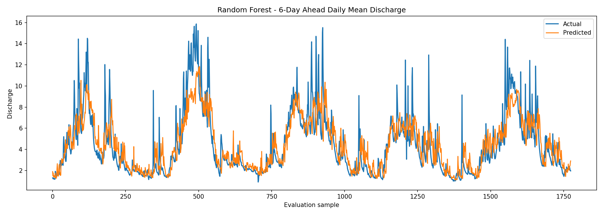
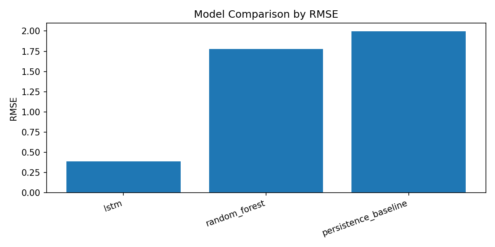

# Flood-Prediction

Flood-Prediction is a machine learning project for forecasting river discharge from hourly precipitation and discharge measurements. The current task is a 6-day-ahead forecast: given historical rainfall and streamflow observations, predict future river discharge 144 hours ahead.

The repository now contains both the original exploratory notebooks and a reproducible Python workflow for preprocessing, feature engineering, baseline evaluation, Random Forest training, LSTM training, and result reporting.

## Project Goals

- Build a reproducible flood forecasting workflow from raw hydrological time-series data.
- Compare simple baselines against machine learning models.
- Prevent time-series data leakage through chronological splits and train-only preprocessing.
- Save metrics, plots, and model artifacts in predictable locations.
- Present results clearly enough for review by recruiters, professors, teammates, or future contributors.

## Dataset

The project uses two hourly data files:

| File | Description |
| --- | --- |
| `data/pr_hourly_DWD_ID1550.dat` | Hourly precipitation observations. |
| `data/Q_hourly_ID16425004.dat` | Hourly river discharge observations. |
| `data/merged.csv` | Cleaned and merged hourly dataset with `datetime`, `pr`, and `Q`. |

The raw files contain timestamp components such as year, month, day, and hour. The preprocessing script builds a proper `datetime` column, cleans invalid values, removes duplicate timestamps, aligns precipitation and discharge by timestamp, and writes the merged dataset.

## Prediction Task

The main prediction target is future discharge 6 days ahead.

Two modeling setups are included:

| Model | Input representation | Target |
| --- | --- | --- |
| Persistence baseline | Current daily mean discharge | Daily mean discharge 6 days ahead |
| Random Forest | Daily hourly pivots, summary statistics, lag features, and rolling features | Daily mean discharge 6 days ahead |
| LSTM | 7-day hourly sequence windows of precipitation and discharge | Hourly discharge 144 hours ahead |

## Repository Structure

```text
Flood-Prediction/
|
+-- README.md
+-- requirements.txt
+-- data/
|   +-- pr_hourly_DWD_ID1550.dat
|   +-- Q_hourly_ID16425004.dat
|   +-- merged.csv
+-- notebooks/
|   +-- preprocess.ipynb
|   +-- random.ipynb
|   +-- lstm.ipynb
|   +-- results_visualization.ipynb
+-- src/
|   +-- data_preprocessing.py
|   +-- feature_engineering.py
|   +-- train_random_forest.py
|   +-- train_lstm.py
|   +-- evaluate.py
|   +-- utils.py
+-- models/
+-- results/
    +-- metrics.json
    +-- model_comparison.csv
    +-- model_comparison.png
    +-- rf_actual_vs_predicted.png
    +-- random_forest_feature_importance.csv
```

## Installation

Create or activate a Python environment, then install the project dependencies:

```bash
python -m pip install -r requirements.txt
```

The workflow uses `numpy`, `pandas`, `matplotlib`, `scikit-learn`, and `tensorflow`.

## How to Run

Run commands from the repository root.

### 1. Preprocess the raw data

```bash
python src/data_preprocessing.py
```

This creates or refreshes:

```text
data/merged.csv
```

### 2. Train the baseline and Random Forest model

```bash
python src/train_random_forest.py
```

This command:

- creates daily features from `data/merged.csv`
- uses a chronological 80/20 train/test split
- evaluates a persistence baseline
- trains a Random Forest model
- saves metrics and plots under `results/`
- saves the trained Random Forest artifact under `models/`

### 3. Train the LSTM model

```bash
python src/train_lstm.py
```

The LSTM script uses 7-day hourly input windows and predicts discharge 144 hours ahead. It uses chronological train, validation, and test periods and fits scalers only on the training period.

Training the LSTM is more expensive than the Random Forest model. For a quick smoke test, run:

```bash
python src/train_lstm.py --epochs 1
```

### 4. Summarize model metrics

```bash
python src/evaluate.py
```

This reads `results/metrics.json`, writes `results/model_comparison.csv`, and saves `results/model_comparison.png`.

### 5. Open the results visualization notebook

```text
notebooks/results_visualization.ipynb
```

This notebook visualizes the persistence baseline, Random Forest, and LSTM results using saved metrics and prediction files. If a saved LSTM model exists and you need to regenerate only the LSTM prediction CSV, run:

```bash
python src/export_lstm_predictions.py
```

## Current Reproducible Results

The following results were generated by the reproducible Random Forest pipeline in `src/`:

| Model | RMSE | MAE | R2 | NSE |
| --- | ---: | ---: | ---: | ---: |
| Persistence baseline | 2.045 | 1.261 | 0.616 | 0.616 |
| Random Forest | 1.894 | 1.278 | 0.670 | 0.670 |

The Random Forest improves RMSE and R2 over the persistence baseline, but its MAE is slightly higher. That suggests the model improves overall variance explanation while still needing better calibration for typical errors.

The earlier exploratory LSTM notebook reported stronger performance than the Random Forest. The LSTM has now been converted into `src/train_lstm.py`, but the final LSTM result should be regenerated from the script before being treated as the official reproducible result.

## Visualizations

Random Forest actual vs. predicted discharge:



Model comparison by RMSE:



## Leakage Prevention

This project is a time-series forecasting task, so leakage prevention is critical.

The reproducible scripts follow these rules:

- Train/test splits are chronological, not random.
- Future discharge targets are created with explicit shifts.
- Lag and rolling features are calculated from historical values.
- LSTM feature and target scalers are fitted only on the training period.
- Validation and test periods are transformed using training-fitted scalers.
- Sequence datasets are created without shuffling.

Any unusually high score should be checked against these assumptions before being presented as a trustworthy forecasting result.

## Feature Engineering

The Random Forest pipeline creates daily features from hourly data:

- 24 hourly precipitation features: `pr_00` through `pr_23`
- 24 hourly discharge features: `Q_00` through `Q_23`
- daily precipitation sum and maximum
- daily discharge mean and maximum
- discharge and precipitation lag features
- 3-day and 7-day rolling precipitation/discharge features
- target variable: `Q_future_6d`

## Notebooks

The original notebooks are preserved in `notebooks/`:

- `notebooks/preprocess.ipynb`
- `notebooks/random.ipynb`
- `notebooks/lstm.ipynb`
- `notebooks/results_visualization.ipynb`

The `results_visualization.ipynb` notebook reads saved metrics and prediction artifacts from `results/` and visualizes the baseline, Random Forest, and LSTM results. The other notebooks are useful for exploration and explanation. The `src/` scripts should be treated as the main reproducible workflow.

## Limitations

- The current workflow uses one precipitation series and one discharge series.
- Extreme flood peaks may require separate evaluation from normal-flow periods.
- The Random Forest model has limited ability to represent long hydrological memory.
- The LSTM result should be regenerated from the script before being used as an official benchmark.
- Additional predictors such as soil moisture, temperature, upstream gauges, land cover, or forecast rainfall may improve performance.
- This project is not validated for operational flood warning or public safety use.

## Future Work

- Regenerate and save final LSTM metrics from `src/train_lstm.py`.
- Add peak-flow-specific metrics and event-based evaluation.
- Add ARIMA, GRU, 1D CNN, or Transformer-based sequence models if justified.
- Test longer historical windows such as 14 or 30 days.
- Add rainfall accumulation features over more hydrologically meaningful windows.
- Add unit tests for preprocessing, feature alignment, and sequence generation.
- Add experiment tracking with CSV or JSON logs.

## Reproducibility Notes

The scripts set random seeds where practical. Some TensorFlow operations may still produce small numerical differences depending on hardware, installed TensorFlow version, and low-level math libraries.
